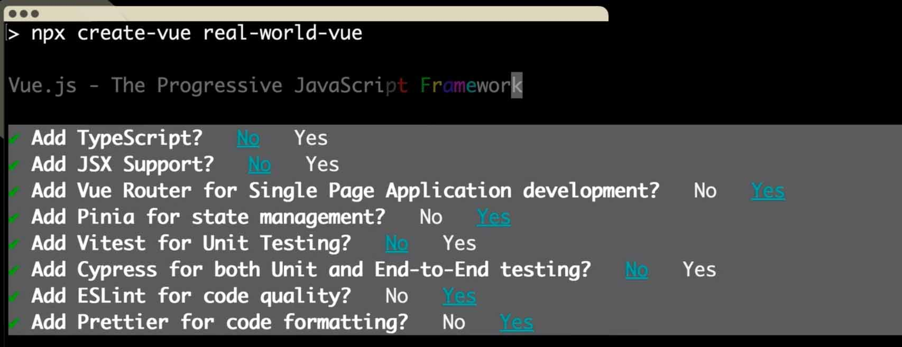
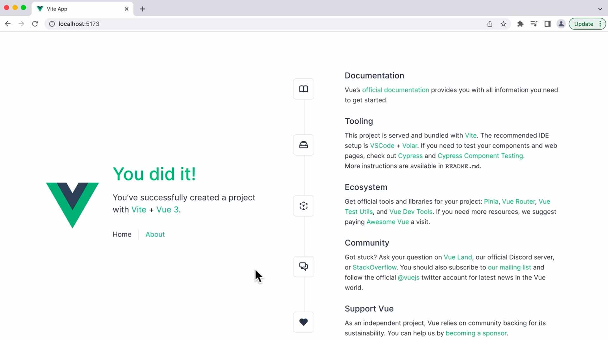
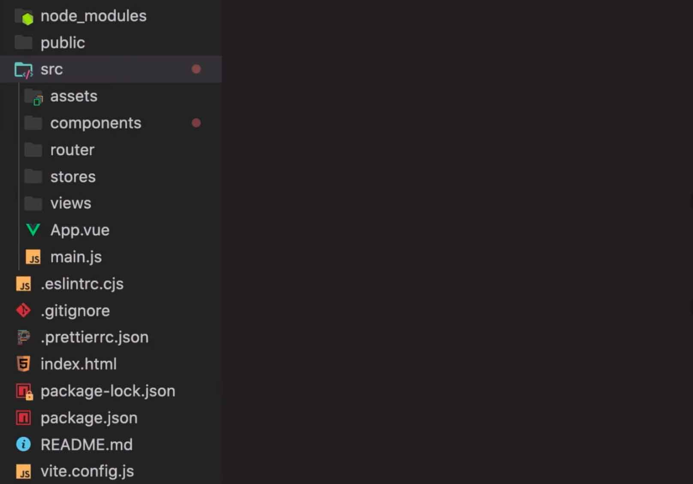
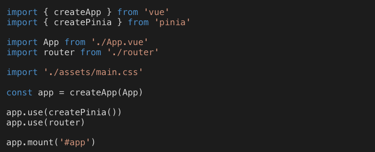
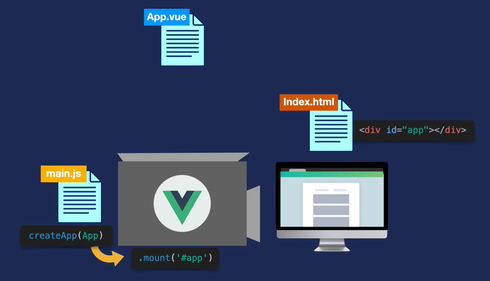

# real-world-vue

This template should help get you started developing with Vue 3 in Vite.

## Recommended IDE Setup

[VSCode](https://code.visualstudio.com/) + [Volar](https://marketplace.visualstudio.com/items?itemName=Vue.volar) (and disable Vetur) + [TypeScript Vue Plugin (Volar)](https://marketplace.visualstudio.com/items?itemName=Vue.vscode-typescript-vue-plugin).

## Customize configuration

See [Vite Configuration Reference](https://vitejs.dev/config/).

## Project Setup

```sh
npm install
```

### Compile and Hot-Reload for Development

```sh
npm run dev
```

### Compile and Minify for Production

```sh
npm run build
```

### Lint with [ESLint](https://eslint.org/)

```sh
npm run lint
```

----

# Create-Vue - Creating the project

## **Creating a Vue project**

To generate a new app using *create-vue*:

1. `npx create-vue name-of-the-project`
    
    This command will start the creation of a Vue project, with the name of “real-world-vue”.
    

1. This will start guiding us through a process where we select the options to configure our project:


We can choose *Yes/No* for each option.

- We’re going to choose *No* for **TypeScript** and **JSX Support**.
- For **Vue Router** and **Pinia**, we’ll choose Yes.
- And then, we’ll choose *No* for **Unit Testing** and **Cypress**.
- Lastly, we’ll choose Yes for **ESLint** and **Prettier** for code linting and formatting respectively.



After going through the options, our project will be created automatically.

---

## Serving our Project

Once our project is done being created, we can `cd` into it.

1 . Install all the dependencies for our new project:

`npm install`

2 . In order to view it live in our browser, we’ll run the command 

`npm run dev`, which compiles the app and serves it live at a local host ([http://localhost:5173](http://localhost:5173/)).



Above is our app, running live in the browser. It already has two pages, the **Home** page and the **About** page, which we can navigate between because it’s using Vue Router.

---

## Touring our Vue Project

Now that we know how to create our project from the terminal and also from the UI, let’s take a look at the project that was created for us.



- The **node_modules** directory is where all of the libraries we need to build Vue are stored.
- The **src** directory is where you’ll spend most of your time since it houses all of the application code.
- You’ll want to put the majority of your assets, such as images and fonts, in the **assets** directory so they can be optimized by Vite.
- The **components** directory is where we store the components, or building blocks, of our Vue app.
- The **router** folder is used for Vue Router, which 
enables our site navigation. We use Vue Router to pull up the different 
“views” of our single page application.
- The **stores** is where we put Pinia code, which handles
 state management throughout the app. By the end of this course, you’ll 
have a basic understanding of what Pinia is for, but we won’t be 
implementing any Pinia code. This course serves as a foundational course
 that prepares you for our other courses on Pinia
- The **views** directory is where we store component files for the different views of our app, which Vue Router loads up.
- The **App.vue** file is the root component that all other components are nested within.
- The **main.js** file is what *renders* our **App.vue** component (and everything nested within it) and *mounts* it to the DOM.
- **eslintrc.cjs** and **.prettier.json** are configuration files for ESLint and Prettier.
- The **index.html** file is where the App.vue component will be mounted to.
- Next, we have a **.gitignore** file where we can specify what we want git to ignore, along our **package.json**, which helps npm identify the project and handle its dependencies, and a **[README.md](https://www.vuemastery.com/courses/real-world-vue-3-composition-api/README.md)**.
- Finally, there’s a **vite.config.js** since this is an app running on Vite.js

---

## How the App is Loaded

You might be wondering now, how is the app being loaded? Let’s take a look at that process.

📁 **src/main.js**



In our **main.js** file, we’re importing the `createApp` method from Vue, along with our **App.js** component. We’re then running that method, feeding in the `App` (the root component that includes all of our application code since all other components are nested within it).

As the method name explicitly states, this creates the app and we’re telling it to `use` the `router` and a newly created Pinia instance. Finally, the app is mounted to the DOM via the `mount` method, which takes in an argument to specify *where* in the DOM the app should be mounted. But where exactly is this id of `"#app"`?

If we peek inside our **index.html** file, we can see there’s a div with the id of `"app"`:

📁 **index.html**


This is where our Vue app is being mounted. Later, we’ll gain a deeper understanding of how this **index.html** serves as the “single page” of our single page application.

---

## Putting it all together

Let’s take a look at this process more visually:



## Wrapping Up

You should now have an understanding of how we can create a Vue 
project and how to manage it from the Vue UI. We also explored the 
project that was created for us to get ready to start customizing this 
project. In the next lesson, we’ll build our first single file .vue 
component.